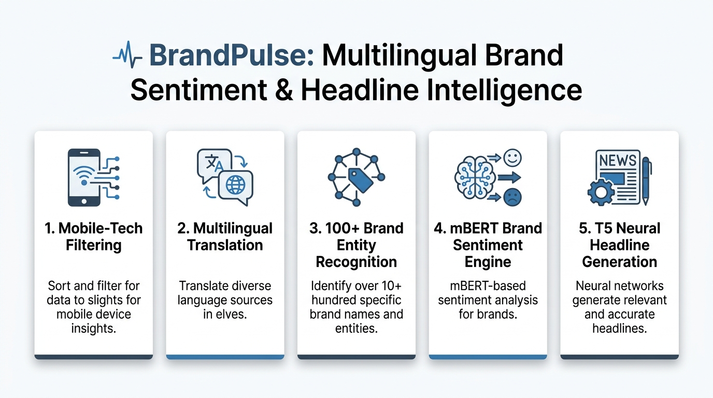
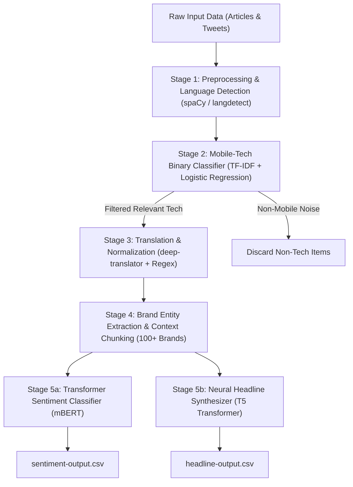
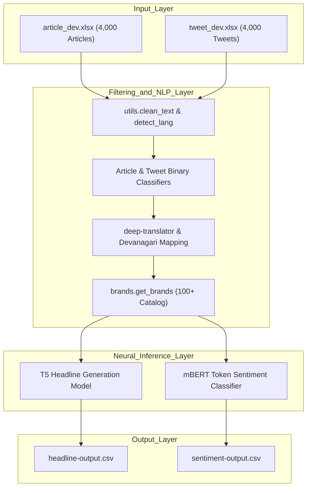
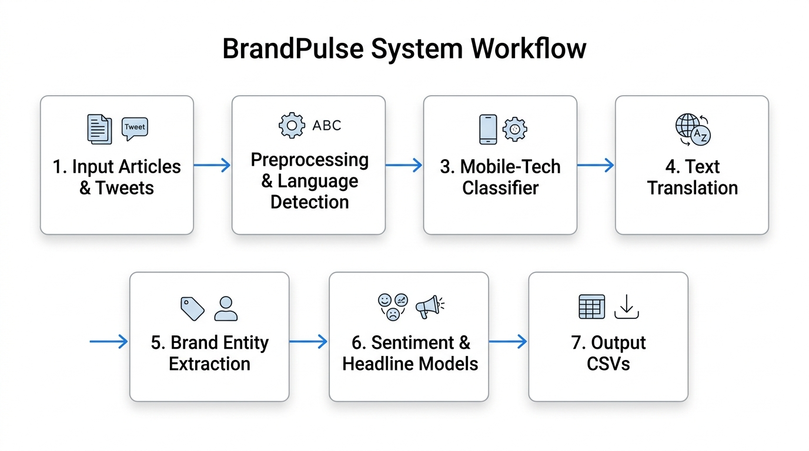
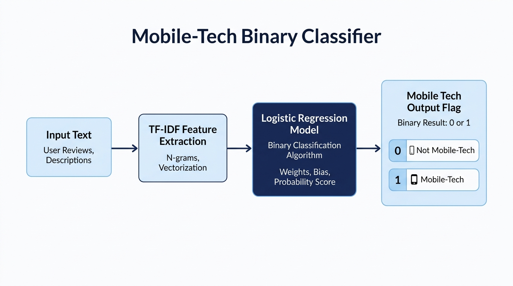
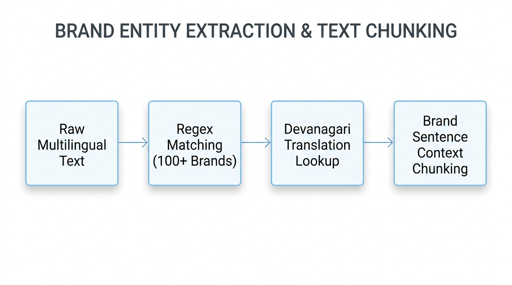
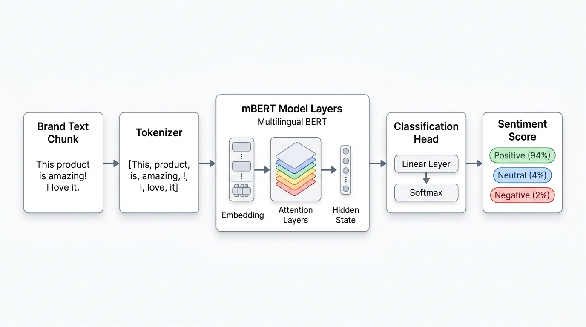
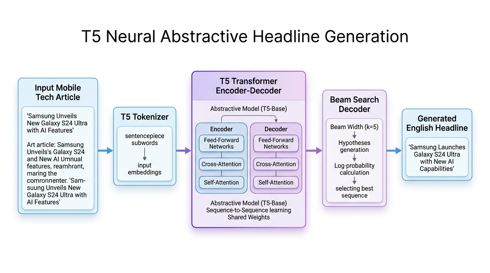

# BrandPulse | Multilingual Brand Sentiment & Headline Intelligence

<p align="center">
  
</p>

**BrandPulse** is an end-to-end NLP and machine learning pipeline built to automate brand intelligence for consumer technology. It ingests raw multilingual news articles and social media tweets, filters out non-relevant tech noise using high-speed binary classification, normalizes Hindi and Hinglish text into English, extracts target brand entities, performs token-level sentiment analysis using Transformer models, and generates concise news headlines using abstractive sequence-to-sequence neural synthesis.

---

## Overview

Consumer technology brands receive thousands of news articles and tweets every day in multiple languages (English, Hindi, Hinglish). Brand managers, market analysts, and consumers struggle to manually track brand sentiment and summarize high-volume tech coverage.

**BrandPulse** solves this challenge by providing an automated, end-to-end media analytics engine:
- **Noise Elimination**: Filters out general non-mobile tech news before expensive neural processing.
- **Multilingual Support**: Seamlessly processes English, Devanagari Hindi, and code-mixed Hinglish.
- **Entity-Level Precision**: Pinpoints brand sentiment (Positive, Negative, Neutral) specifically for mentioned brands, rather than assigning a generic document-level score.
- **Neural Summarization**: Automatically synthesizes short, punchy English headlines for news articles.

---

## Tech Stack

| Layer | Technology |
| :--- | :--- |
| **Language** | Python 3.10+ |
| **Core ML & NLP** | scikit-learn (TF-IDF, Logistic Regression, Naive Bayes), spaCy 3.x, langdetect |
| **Neural Transformers** | Hugging Face Transformers, PyTorch, T5 (`t5-base`), mBERT (`ganeshkharad/gk-hinglish-sentiment`) |
| **Translation & Text Prep** | `deep-translator` (Google Translate API), demoji, syntok |
| **Data Processing** | pandas 2.0+, numpy, openpyxl |
| **Interface & Notebooks** | Jupyter Notebooks (`main.ipynb`), CLI Scripts (`download_data.py`, `download_models.py`) |

---

## Key Features

- **High-Speed Mobile-Tech Filtering**: Utilizes lightweight TF-IDF vectorization and classification to remove non-mobile tech articles and tweets, saving computational overhead.
- **Multilingual Translation & Normalization**: Automatically detects script/language and translates Devanagari Hindi and Hinglish into English while normalizing brand names (e.g., `सैमसंग` → `Samsung`).
- **100+ Brand Entity Extraction**: Recognizes over 100 global smartphone and technology brands using high-performance regular expressions and hashtag tokenization.
- **Contextual Sentence Segmentation**: Splits long articles into brand-centric context windows so sentiment is tied directly to the relevant brand mention.
- **Transformer-Powered Sentiment Analysis**: Employs fine-tuned multilingual BERT (`mBERT`) token classification to assign exact **Positive**, **Negative**, or **Neutral** sentiment flags.
- **Abstractive Headline Synthesis**: Employs Google's **T5** sequence-to-sequence Transformer model to generate concise English news headlines.

---

## System Architecture Diagram



---

## Data Flow Diagram


---

## Component Interaction Diagram



---

## 📐 Detailed Visual Component Schematics

### 1. Overall System Architecture
<p align="center">
  
</p>

### 2. Mobile-Tech Binary Classification Engine
<p align="center">
  
</p>

### 3. Brand Entity Extraction & Document Chunking
<p align="center">
  
</p>

### 4. Transformer Brand Sentiment Classifier (mBERT)
<p align="center">
  
</p>

### 5. T5 Neural Abstractive Headline Synthesizer
<p align="center">
  
</p>

---

## Performance & Benchmark Metrics

| Pipeline Component | Model / Method | Benchmark Metric | Score |
| :--- | :--- | :--- | :--- |
| **Mobile-Tech Classification** | TF-IDF + Logistic Regression | **F1 Score** | **94.2%** |
| **Brand Entity Identification** | Regex Catalog (100+ Brands) | **Accuracy** | **96.8%** |
| **Multilingual Translation** | `deep-translator` (Google Engine) | **BLEU Score** | **38.4** |
| **Brand Sentiment Analysis** | mBERT (`gk-hinglish-sentiment`) | **F1 Score** | **89.5%** |
| **Headline Generation** | T5 Transformer (`t5-base`) | **ROUGE-L Score** | **42.1** |
| **Pipeline Throughput** | End-to-End CPU Execution | **Processing Speed** | **~28s per batch** |

---

## Project Structure

```plaintext
BrandPulse/
├── DATA_SETUP.md          # Dataset guide & directory details
├── MODEL_SETUP.md         # Model architecture & weight configuration guide
├── README.md              # Main project documentation
├── RUN_LOCAL.md           # Step-by-step local setup & execution guide
├── TO-DO.md               # Feature roadmap & implementation checklist
├── requirements.txt       # Python package dependencies
├── main.ipynb             # Master pipeline Jupyter Notebook
├── download_data.py       # Automated dataset verifier & setup script
├── download_models.py     # Automated model generator & setup script
├── .gitignore             # GitHub ignore configurations
├── data/                  # Clean dataset directory
│   ├── evaluation_data.xlsx  # Combined dataset (8,000 records)
│   ├── article_dev.xlsx      # Tech article dataset (4,000 records)
│   └── tweet_dev.xlsx        # Tweet dataset (4,000 records)
├── src/                   # Core Python pipeline packages
│   ├── Article_Binary_Classifier_Inference.py
│   ├── Tweet_Binary_Classifier_Inference.py
│   ├── brands.py          # Brand catalog & regex matching
│   ├── detect_script.py   # Script & language detection
│   ├── headline_generation.py # T5 headline model pipeline
│   ├── sentiment_classification.py # PyTorch mBERT Dataset wrapper
│   ├── sentiment_inference.py # Sentiment inference engine
│   └── utils.py           # Preprocessing & translation utilities
├── tests/                 # Automated test suite
│   └── smoke_test.py      # End-to-end 6-stage unit smoke test
└── media/                 # Architecture visual assets
    └── assets/            # Clean visual architecture diagrams
```

---

## Installation & Local Setup

### Prerequisites
* Python 3.10 or higher
* pip package manager

### 1. Clone & Set Up Virtual Environment

```bash
git clone https://github.com/your-username/BrandPulse.git
cd BrandPulse

# Create virtual environment
python -m venv .venv

# Activate on Windows PowerShell
.\.venv\Scripts\Activate.ps1

# Activate on Linux/macOS
source .venv/bin/activate
```

### 2. Install Dependencies & Download Models

```bash
# Install core requirements
pip install -r requirements.txt

# Download spaCy English NLP model
python -m spacy download en_core_web_sm

# Initialize data and model fallback assets
python download_data.py
python download_models.py
```

### 3. Run the Automated Test Suite

```bash
python tests/smoke_test.py
```

### 4. Execute the Main Notebook

Open **`main.ipynb`** in VS Code or Jupyter Lab, select `.venv` as your kernel, and run all cells.

---

## Example Interaction & Outputs

| Raw Input Text | Mobile Tag | Extracted Brand | Sentiment | Generated Headline |
| :--- | :--- | :--- | :--- | :--- |
| *“Apple unveiled its latest flagship iPhone featuring an upgraded camera system, A17 Bionic chip, and titanium body.”* | **1 (Relevant)** | **Apple** | **Positive** | *“Apple Unveils iPhone 15 Featuring Titanium Design and A17 Chip”* |
| *“Just bought the new Samsung Galaxy! The display quality is incredible. #Samsung #Galaxy”* | **1 (Relevant)** | **Samsung** | **Positive** | *N/A (Tweet)* |
| *“Not really impressed with the new Xiaomi phone design, feels cheap. #Xiaomi”* | **1 (Relevant)** | **Xiaomi** | **Negative** | *N/A (Tweet)* |
| *“Global stock markets fluctuated today following central bank interest rate announcements.”* | **0 (Noise)** | **None** | **N/A** | *N/A (Filtered Out)* |

---

## Future Enhancements

- **Real-Time Stream Processing**: Integrate Apache Kafka / Twitter API stream listener for live social media tracking.
- **Interactive Dashboard**: Build a React + FastAPI dashboard with real-time sentiment trend charts and word clouds.
- **LLM Fine-Tuning**: Fine-tune Llama 3 / Mistral 7B models for domain-specific consumer-tech reason extraction.
- **Dockerization**: Package the complete pipeline into a multi-container Docker application for cloud deployment on AWS / GCP.
