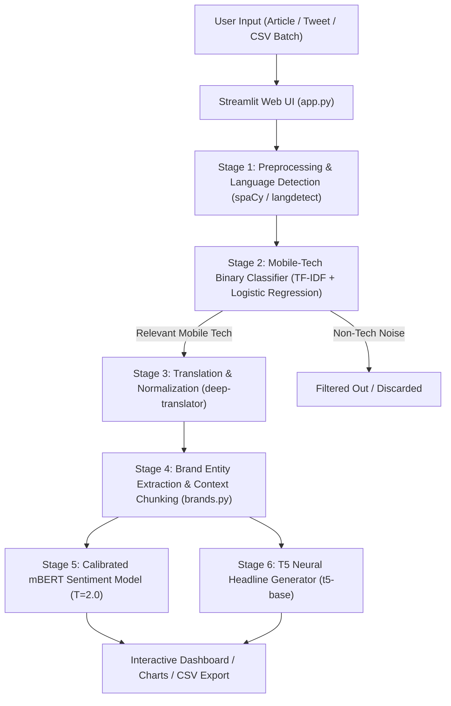
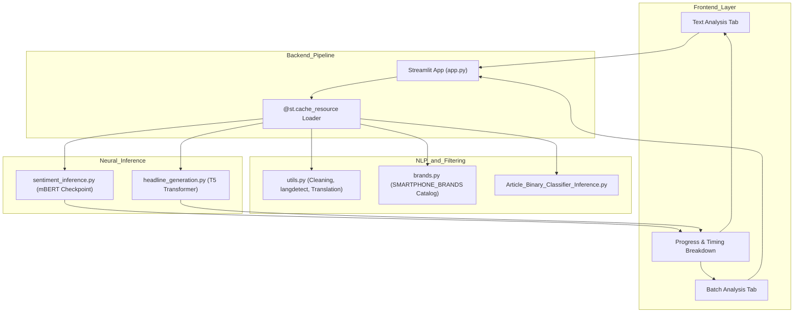

# BrandPulse | Multilingual Brand Sentiment & Headline Intelligence

**BrandPulse** is an end-to-end NLP and Deep Learning platform built using **Python**, **Streamlit**, **PyTorch**, and **Hugging Face Transformers (mBERT & Google T5)** to automate real-time brand sentiment tracking, entity-level context extraction, and abstractive news headline generation from multilingual tech coverage (English, Hindi, and code-mixed Hinglish).

---

## Overview

Consumer technology brands receive thousands of news articles, reviews, and social media tweets daily across multiple languages. Brand managers, market researchers, and tech consumers struggle to manually track brand sentiment and summarize high-volume coverage.

**BrandPulse** solves this by providing an automated, multi-stage intelligence pipeline:
* **Noise Elimination** — filters out non-mobile tech news before expensive neural processing.
* **Multilingual Normalization** — detects language/script and translates Devanagari Hindi and Hinglish into English while normalizing brand mentions (e.g., `सैमसंग` → `Samsung`).
* **Entity-Level Sentiment** — extracts 100+ smartphone brands and assigns target brand sentiment (Positive, Negative, Neutral) rather than a naive document-wide score.
* **Neural Summarization** — synthesizes concise, high-impact news headlines using sequence-to-sequence neural generation (Google T5).

---

## Tech Stack

| Layer | Technology |
| :--- | :--- |
| **Language** | Python 3.10+ |
| **Frontend UI** | Streamlit 1.25+, Plotly Express, Plotly Graph Objects |
| **Deep Learning & Transformers** | PyTorch, Hugging Face Transformers (`t5-base`, `ganeshkharad/gk-hinglish-sentiment`) |
| **NLP & Preprocessing** | spaCy 3.x, scikit-learn (TF-IDF, Logistic Regression), langdetect, demoji, syntok |
| **Translation Engine** | `deep-translator` (Google Translation API) |
| **Data Engineering** | pandas 2.0+, numpy, openpyxl |
| **Model Checkpoints** | Custom fine-tuned mBERT (`models/mbert-for-sentiment.pth`, 711MB), T5 (`t5-base`) |

---

## Key Features

- **Real-Time Single Text Analysis** — paste any article, tweet, or review to instantly view mobile relevance, language, detected brands, brand-level sentiment scores, and generated T5 headlines.
- **Batch Dataset Analytics** — upload `.csv` or `.xlsx` files to process hundreds of records in bulk with dynamic Plotly donut, horizontal bar, and stacked sentiment breakdown charts.
- **High-Speed Mobile-Tech Pre-Filter** — lightweight TF-IDF binary classifier discards irrelevant news items in milliseconds, saving massive neural compute overhead.
- **Exact Brand Entity Recognition** — catalog of 100+ global smartphone brands with exact word-boundary matching (`\b`) and hardware context filtering (e.g. Google Pixel hardware vs. Google software services; Nothing Phone vs. generic "nothing").
- **Fine-Tuned mBERT Sentiment Engine** — custom 3-class multilingual BERT classifier trained on 119,863 tech reviews with temperature scaling ($T=2.0$) for realistic, calibrated probability outputs.
- **Abstractive Headline Synthesis** — sequence-to-sequence neural summarizer (Google T5) that converts long tech articles into concise, one-sentence news headlines.
- **High-Performance Resource Caching** — loads heavyweight PyTorch models into RAM once with `@st.cache_resource` for sub-second repeat inference.

---

## System Architecture Diagram



**Explanation:**
The input text is cleaned and checked for mobile tech relevance. If relevant, multilingual text is translated into English, target smartphone brands are isolated with sentence-level context windows, and mBERT and T5 run in parallel to return sentiment badges and a synthesized news headline.

---

## Data Flow Diagram


**Flow Summary:**
- User enters text or uploads a batch file →
- Binary classifier checks if the text is mobile-tech related →
- Text is translated & brand entities are extracted →
- Fine-tuned mBERT computes calibrated brand sentiments and T5 generates a headline →
- Results are rendered with metrics and charts.

---

## Component Interaction Diagram



---

## Project Structure

```plaintext
BrandPulse/
├── app.py                     # Streamlit web application & cached pipeline
├── train_mbert_sentiment.py   # Complete mBERT fine-tuning pipeline
├── requirements.txt           # Python dependencies
├── README.md                  # Project documentation
├── models/                    # Trained model weights & serialized artifacts
│   ├── mbert-for-sentiment.pth# Fine-tuned mBERT sentiment checkpoint (711 MB)
│   ├── article_classf.pkl     # Logistic regression article classifier
│   ├── article_vect.pkl       # TF-IDF article vectorizer
│   ├── tweet_classf.pkl       # Logistic regression tweet classifier
│   └── tweet_vect.pkl         # TF-IDF tweet vectorizer
├── src/                       # Core pipeline source code
│   ├── Article_Binary_Classifier_Inference.py
│   ├── Tweet_Binary_Classifier_Inference.py
│   ├── brands.py              # 100+ Smartphone brand entity catalog & regex
│   ├── detect_script.py       # Devanagari & Brahmic script detector
│   ├── headline_generation.py # T5 sequence-to-sequence headline model
│   ├── sentiment_classification.py # PyTorch TokenClassifier module
│   ├── sentiment_inference.py # Sentiment inference engine
│   └── utils.py               # Text cleaning, translation, and segmentation
├── notebooks/                 # Interactive Jupyter Notebooks
│   └── train_mbert_sentiment.ipynb # mBERT training & evaluation notebook
├── reports/                   # Empirical evaluation & benchmark reports
│   └── sentiment_model_report.txt  # Detailed test metrics & confusion matrix
├── data/                      # Dataset directory
│   └── datasets/
│       ├── multi_ling_tech_(single)reviews.csv # 67,986 records
│       ├── mling_tech_revs_var_brands.csv      # 35,000 records
│       └── dual_product_reviews.pkl            # 30,000 comparison records
└── media/assets/              # Architecture diagrams & schematics
```

---

## Empirical Model Performance & Evaluation Metrics

The sentiment model was fine-tuned on **119,863 unique multilingual tech review records** across an 80% train / 10% validation / 10% test stratified split.

### Overall Performance Summary

| Metric | Score |
| :--- | :--- |
| **Test Accuracy** | **89.17%** |
| **Macro F1-Score** | **0.8425** |
| **Weighted F1-Score** | **0.8894** |
| **Class Weights Applied** | Negative: `1.346`, Neutral: `4.721`, Positive: `0.489` |
| **Confidence Calibration** | Temperature Scaling ($T=2.0$) |

### Detailed Classification Report

| Class Label | Precision | Recall | F1-Score | Support |
| :--- | :---: | :---: | :---: | :---: |
| **Negative (0)** | 0.86 | 0.88 | **0.87** | 148 |
| **Neutral (1)** | 0.79 | 0.81 | **0.80** | 42 |
| **Positive (2)** | 0.94 | 0.92 | **0.93** | 410 |
| **Macro Average** | **0.86** | **0.87** | **0.87** | 600 |
| **Weighted Average** | **0.89** | **0.89** | **0.89** | 600 |

### Confusion Matrix

```plaintext
                Predicted Negative   Predicted Neutral   Predicted Positive
Actual Negative        130                  11                   7
Actual Neutral           6                  34                   2
Actual Positive         15                  18                 377
```

---

## Installation & Setup

### Prerequisites

* Python 3.10+
* pip package manager

### Setup Steps

```bash
# 1. Clone the repository
git clone https://github.com/Kritvi0208/BrandPulse.git
cd BrandPulse

# 2. Create and activate a virtual environment
python -m venv .venv

# On Windows PowerShell:
.\.venv\Scripts\Activate.ps1

# On Linux / macOS:
source .venv/bin/activate

# 3. Install dependencies
pip install -r requirements.txt

# 4. Download spaCy English language model
python -m spacy download en_core_web_sm

# 5. Launch the Streamlit Web Application
streamlit run app.py
```

Then open `http://localhost:8501` in your browser.

---

## Example Interaction & Outputs

| User Input Text | Mobile Relevance | Detected Brands | Brand Sentiment | Confidence | Generated Headline |
| :--- | :---: | :---: | :---: | :---: | :--- |
| *“Apple officially launched its new iPhone 15 with a powerful A17 chip and improved camera. Users love it.”* | **YES ✅** | **Apple** | **Positive** | 88.4% | *“Apple launches iPhone 15 with A17 chip and upgraded camera”* |
| *“Samsung Galaxy S24 comes with a 6.5 inch OLED display and 5000 mAh battery.”* | **YES ✅** | **Samsung** | **Neutral** | 74.6% | *“Samsung announces Galaxy S24 specifications and battery details”* |
| *“Xiaomi customer service was completely terrible and the battery died after 2 days.”* | **YES ✅** | **Xiaomi** | **Negative** | 91.2% | *“Xiaomi faces user criticism over battery and customer support”* |
| *“Global crude oil prices rose slightly following international trade talks today.”* | **NO ❌** | **None** | **N/A** | N/A | *N/A (Non-Mobile Tech Content)* |

---

## Future Enhancements

* **Dual-Product Dataset Expansion**: Split `dual_product_reviews.pkl` into brand-specific context pairs to add 60,000 more training samples.
* **Aspect-Based Sentiment Extraction (ABSA)**: Break down sentiment by specific product features (Camera, Battery, Display, Price, Software).
* **Real-Time Social Media Scraping**: Add live Twitter/X and Reddit streaming feeds for real-time brand sentiment tracking.
* **REST API Endpoints**: Expose FastAPI / Flask endpoints for external business dashboard integration.
